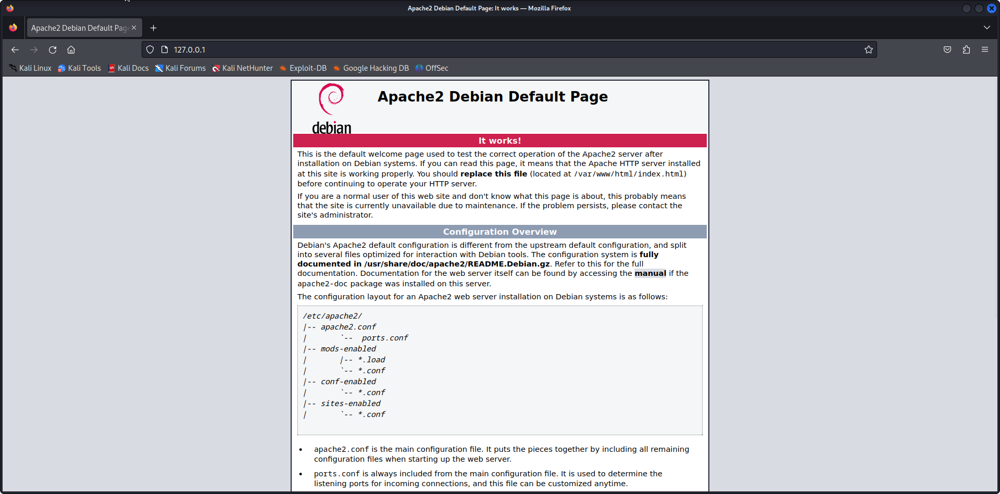
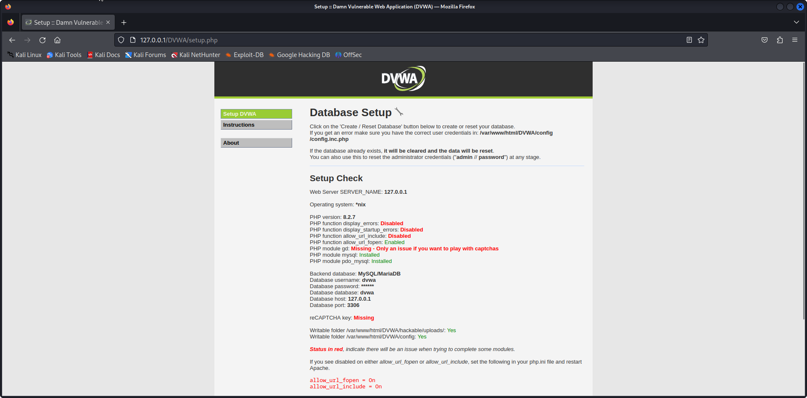
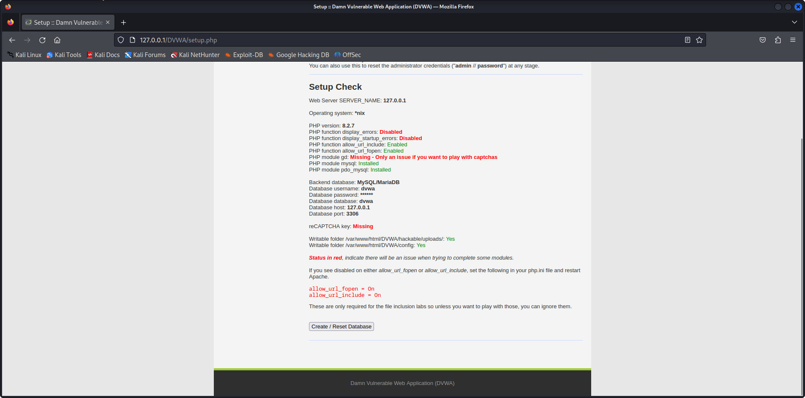
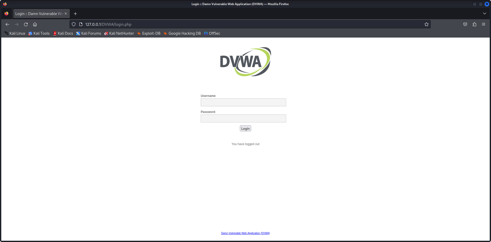
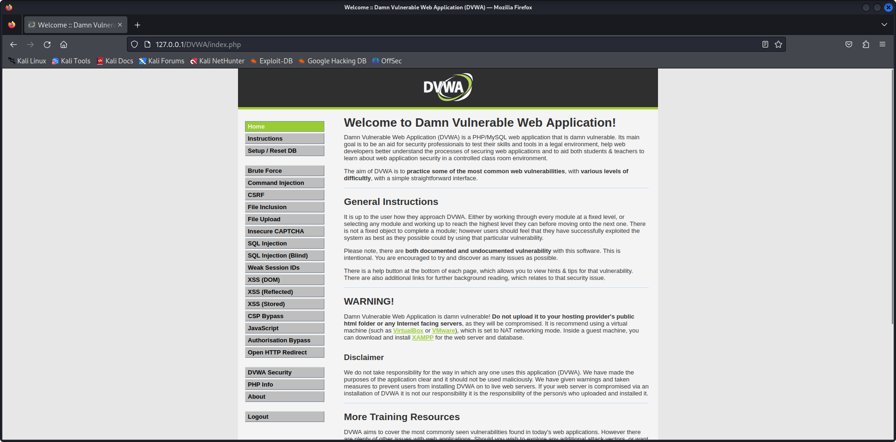

Installing DVWA  How to Install and Setup Damn Vulnerable Web Application in Kali Linux  Edureka

```
https://www.youtube.com/watch?v=PaB17Cc0dUg
```

# 1 - Download and Install DVWA

```
https://github.com/digininja/DVWA
```

```
cd /var/www/html/
```

```
sudo git clone https://github.com/digininja/DVWA.git
```

```
ls
```

```
sudo chmod -R 777 DVWA
```

```
cd DVWA/config
```

```
ls
```

```
cp config.inc.php.dist config.inc.php
```

```
sudo mousepad config.inc.php
```

```
$_DVWA = array();
$_DVWA[ 'db_server' ]   = getenv('DB_SERVER') ?: '127.0.0.1';
$_DVWA[ 'db_database' ] = 'dvwa';
$_DVWA[ 'db_user' ]     = 'dvwa';
$_DVWA[ 'db_password' ] = 'p@ssw0rd';
$_DVWA[ 'db_port']      = '3306';
```

Change to 

```
$_DVWA = array();
$_DVWA[ 'db_server' ]   = getenv('DB_SERVER') ?: '127.0.0.1';
$_DVWA[ 'db_database' ] = 'dvwa';
$_DVWA[ 'db_user' ]     = 'user';
$_DVWA[ 'db_password' ] = 'pass';
$_DVWA[ 'db_port']      = '3306';
```

# 2 - Config Database

```
service mysql start
```

```
sudo mysql -u root -p
```

```
MariaDB [(none)]> SHOW DATABASES;
+--------------------+
| Database           |
+--------------------+
| information_schema |
| mysql              |
| performance_schema |
| sys                |
+--------------------+
4 rows in set (0.012 sec)
```

```
MariaDB [(none)]> CREATE DATABASE dvwa;
Query OK, 1 row affected (0.012 sec)
```

```
MariaDB [(none)]> use mysql
Reading table information for completion of table and column names
You can turn off this feature to get a quicker startup with -A

Database changed
```

```
MariaDB [mysql]> show tables;
+---------------------------+
| Tables_in_mysql           |
+---------------------------+
| column_stats              |
| columns_priv              |
| db                        |
| event                     |
| func                      |
| general_log               |
| global_priv               |
| gtid_slave_pos            |
| help_category             |
| help_keyword              |
| help_relation             |
| help_topic                |
| index_stats               |
| innodb_index_stats        |
| innodb_table_stats        |
| plugin                    |
| proc                      |
| procs_priv                |
| proxies_priv              |
| roles_mapping             |
| servers                   |
| slow_log                  |
| table_stats               |
| tables_priv               |
| time_zone                 |
| time_zone_leap_second     |
| time_zone_name            |
| time_zone_transition      |
| time_zone_transition_type |
| transaction_registry      |
| user                      |
+---------------------------+
31 rows in set (0.000 sec)
```

```
MariaDB [mysql]> DESCRIBE user;
+------------------------+---------------------+------+-----+----------+-------+
| Field                  | Type                | Null | Key | Default  | Extra |
+------------------------+---------------------+------+-----+----------+-------+
| Host                   | char(255)           | NO   |     |          |       |
| User                   | char(128)           | NO   |     |          |       |
| Password               | longtext            | YES  |     | NULL     |       |
| Select_priv            | varchar(1)          | YES  |     | NULL     |       |
| Insert_priv            | varchar(1)          | YES  |     | NULL     |       |
| Update_priv            | varchar(1)          | YES  |     | NULL     |       |
| Delete_priv            | varchar(1)          | YES  |     | NULL     |       |
| Create_priv            | varchar(1)          | YES  |     | NULL     |       |
| Drop_priv              | varchar(1)          | YES  |     | NULL     |       |
| Reload_priv            | varchar(1)          | YES  |     | NULL     |       |
| Shutdown_priv          | varchar(1)          | YES  |     | NULL     |       |
| Process_priv           | varchar(1)          | YES  |     | NULL     |       |
| File_priv              | varchar(1)          | YES  |     | NULL     |       |
| Grant_priv             | varchar(1)          | YES  |     | NULL     |       |
| References_priv        | varchar(1)          | YES  |     | NULL     |       |
| Index_priv             | varchar(1)          | YES  |     | NULL     |       |
| Alter_priv             | varchar(1)          | YES  |     | NULL     |       |
| Show_db_priv           | varchar(1)          | YES  |     | NULL     |       |
| Super_priv             | varchar(1)          | YES  |     | NULL     |       |
| Create_tmp_table_priv  | varchar(1)          | YES  |     | NULL     |       |
| Lock_tables_priv       | varchar(1)          | YES  |     | NULL     |       |
| Execute_priv           | varchar(1)          | YES  |     | NULL     |       |
| Repl_slave_priv        | varchar(1)          | YES  |     | NULL     |       |
| Repl_client_priv       | varchar(1)          | YES  |     | NULL     |       |
| Create_view_priv       | varchar(1)          | YES  |     | NULL     |       |
| Show_view_priv         | varchar(1)          | YES  |     | NULL     |       |
| Create_routine_priv    | varchar(1)          | YES  |     | NULL     |       |
| Alter_routine_priv     | varchar(1)          | YES  |     | NULL     |       |
| Create_user_priv       | varchar(1)          | YES  |     | NULL     |       |
| Event_priv             | varchar(1)          | YES  |     | NULL     |       |
| Trigger_priv           | varchar(1)          | YES  |     | NULL     |       |
| Create_tablespace_priv | varchar(1)          | YES  |     | NULL     |       |
| Delete_history_priv    | varchar(1)          | YES  |     | NULL     |       |
| ssl_type               | varchar(9)          | YES  |     | NULL     |       |
| ssl_cipher             | longtext            | NO   |     |          |       |
| x509_issuer            | longtext            | NO   |     |          |       |
| x509_subject           | longtext            | NO   |     |          |       |
| max_questions          | bigint(20) unsigned | NO   |     | 0        |       |
| max_updates            | bigint(20) unsigned | NO   |     | 0        |       |
| max_connections        | bigint(20) unsigned | NO   |     | 0        |       |
| max_user_connections   | bigint(21)          | NO   |     | 0        |       |
| plugin                 | longtext            | NO   |     |          |       |
| authentication_string  | longtext            | NO   |     |          |       |
| password_expired       | varchar(1)          | NO   |     |          |       |
| is_role                | varchar(1)          | YES  |     | NULL     |       |
| default_role           | longtext            | NO   |     |          |       |
| max_statement_time     | decimal(12,6)       | NO   |     | 0.000000 |       |
+------------------------+---------------------+------+-----+----------+-------+
47 rows in set (0.001 sec)
```

```
MariaDB [mysql]> select `Host`, `user`, `password`  FROM user;
+-----------+-------------+----------+
| Host      | User        | Password |
+-----------+-------------+----------+
| localhost | mariadb.sys |          |
| localhost | root        | invalid  |
| localhost | mysql       | invalid  |
+-----------+-------------+----------+
3 rows in set (0.001 sec)
```

```
MariaDB [mysql]> CREATE USER 'user'@'127.0.0.1' IDENTIFIED BY 'pass';
Query OK, 0 rows affected (0.002 sec)
```

```
MariaDB [mysql]> select `Host`, `user`, `password`  FROM user;
+-----------+-------------+-------------------------------------------+
| Host      | User        | Password                                  |
+-----------+-------------+-------------------------------------------+
| localhost | mariadb.sys |                                           |
| localhost | root        | invalid                                   |
| localhost | mysql       | invalid                                   |
| 127.0.0.1 | user        | *196BDEDE2AE4F84CA44C47D54D78478C7E2BD7B7 |
+-----------+-------------+-------------------------------------------+
4 rows in set (0.001 sec)
```

```
GRANT ALL PRIVILEGES ON dvwa.* to 'user'@'127.0.0.1' IDENTIFIED BY 'pass';
```

```
MariaDB [(none)]> CREATE USER 'dvwa'@'localhost' IDENTIFIED BY 'pass';
Query OK, 0 rows affected (0.014 sec)
```

```
MariaDB [mysql]> select `Host`, `user`, `password`  FROM user;
+-----------+-------------+-------------------------------------------+
| Host      | User        | Password                                  |
+-----------+-------------+-------------------------------------------+
| localhost | mariadb.sys |                                           |
| localhost | root        | invalid                                   |
| localhost | mysql       | invalid                                   |
| 127.0.0.1 | user        | *196BDEDE2AE4F84CA44C47D54D78478C7E2BD7B7 |
| localhost | dvwa        | *196BDEDE2AE4F84CA44C47D54D78478C7E2BD7B7 |
+-----------+-------------+-------------------------------------------+
5 rows in set (0.001 sec)
```

```
GRANT ALL PRIVILEGES ON dvwa.* to 'dvwa'@'localhost' IDENTIFIED BY 'pass';
```

# 3 - Config Server

```
service apache2 start
```

```
which php
```

```                  
/usr/bin/php
```

```
php --version

PHP 8.2.7 (cli) (built: Jun  9 2023 06:51:32) (NTS)
Copyright (c) The PHP Group
Zend Engine v4.2.7, Copyright (c) Zend Technologies
    with Zend OPcache v8.2.7, Copyright (c), by Zend Technologies
```

```
cd /etc/php/8.2/apache2
```

```
ls
```

```
sudo mousepad php.ini
```

```
mousepad -> Search -> Find -> display_errors
```

```
display_errors = Off

; The display of errors which occur during PHP's startup sequence are handled
; separately from display_errors. We strongly recommend you set this to 'off'
; for production servers to avoid leaking configuration details.
; Default Value: On
; Development Value: On
; Production Value: Off
; https://php.net/display-startup-errors
display_startup_errors = Off
```

Change To

```
display_errors = On

; The display of errors which occur during PHP's startup sequence are handled
; separately from display_errors. We strongly recommend you set this to 'off'
; for production servers to avoid leaking configuration details.
; Default Value: On
; Development Value: On
; Production Value: Off
; https://php.net/display-startup-errors
display_startup_errors = On
```

```
mousepad -> Search -> Find -> allow_url_fopen
```

```
;;;;;;;;;;;;;;;;;;
; Fopen wrappers ;
;;;;;;;;;;;;;;;;;;

; Whether to allow the treatment of URLs (like http:// or ftp://) as files.
; https://php.net/allow-url-fopen
allow_url_fopen = On

; Whether to allow include/require to open URLs (like https:// or ftp://) as files.
; https://php.net/allow-url-include
allow_url_include = Off
```

Change To

```
;;;;;;;;;;;;;;;;;;
; Fopen wrappers ;
;;;;;;;;;;;;;;;;;;

; Whether to allow the treatment of URLs (like http:// or ftp://) as files.
; https://php.net/allow-url-fopen
allow_url_fopen = On

; Whether to allow include/require to open URLs (like https:// or ftp://) as files.
; https://php.net/allow-url-include
allow_url_include = On
```

```
mousepad -> Search -> Find -> gd
```

```
;extension=gd
```

Change To

```
extension=gd
```

```
service apache2 start
```








# login page

```
username: admin
password: password
```
