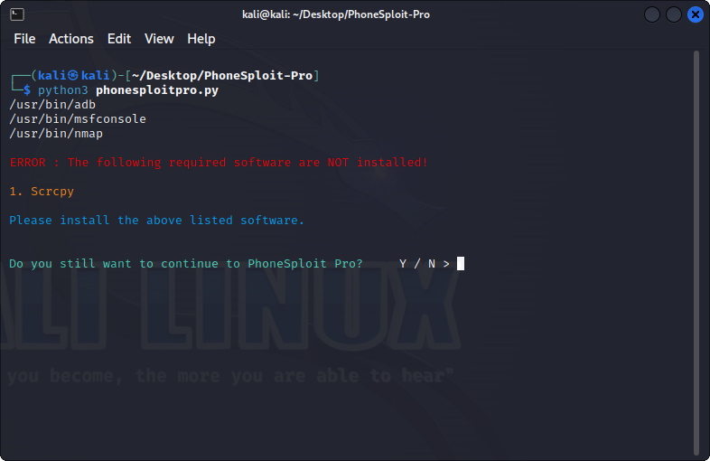
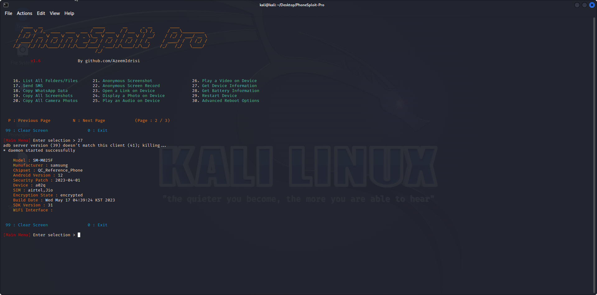

# 1 - Introduction

PhoneSploit Pro is a powerful open-source tool written in Python language to remotely exploit Android devices using ADB
(Android Debug Bridge) and Metasploit-Framework. It comes with Metasploit Integration. With only one click, this tool 
can fully hack an Android smartphone by automatically creating, installing, and running a payload on the target device 
using the Metasploit Framework and ADB. This project aims to simplify Android device penetration testing. 
Now PhoneSploit Pro handles learning commands and parameters for you. You may quickly test the security of your Android 
devices using this tool.

OS 

Kali Linux 

OR

Parrot OS

# 2 - Setup

```
sudo nmap -sS -p- -Pn 192.168.1.0 > scan.txt
```

```
sudo apt update
```

```
sudo apt install scrcpy
```

```
sudo apt install adb
```

```
cd Desktop
```

```
git clone https://github.com/AzeemIdrisi/PhoneSploit-Pro
```

```
cd PhoneSploit-Pro
```

```
pip install python-nmap
```

```
service snapd.apparmor start 
```

```
python3 phonesploitpro.py
```








