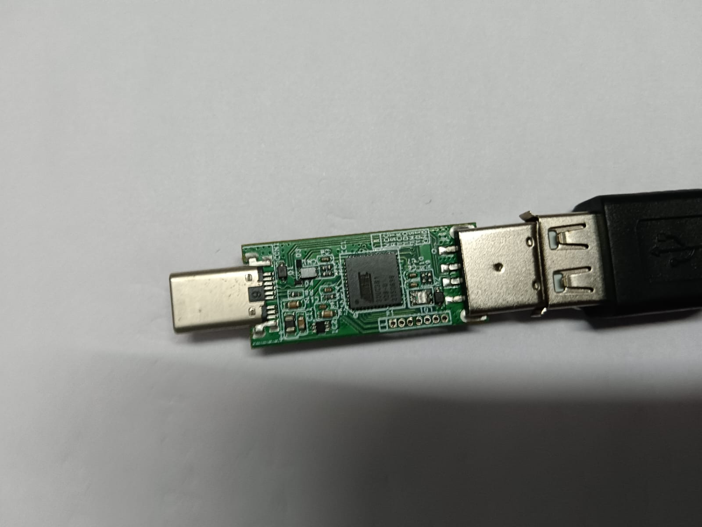

## Turn On / Off LED 


# 3 - Turn on LED - RED

```
ATTACKMODE HID STORAGE

DELAY 3000

WHILE TRUE
  IF ($_CAPSLOCK_ON == TRUE) THEN
    LED_R
  ELSE IF ($_CAPSLOCK_ON == FALSE) THEN
    LED_OFF
  END_IF
END_WHILE
```




# 6 - Turn on LED  - GREEN

```
ATTACKMODE HID STORAGE

DELAY 3000

WHILE TRUE
  IF ($_CAPSLOCK_ON == TRUE) THEN
    LED_G
  ELSE IF ($_CAPSLOCK_ON == FALSE) THEN
    LED_OFF
  END_IF
END_WHILE
```